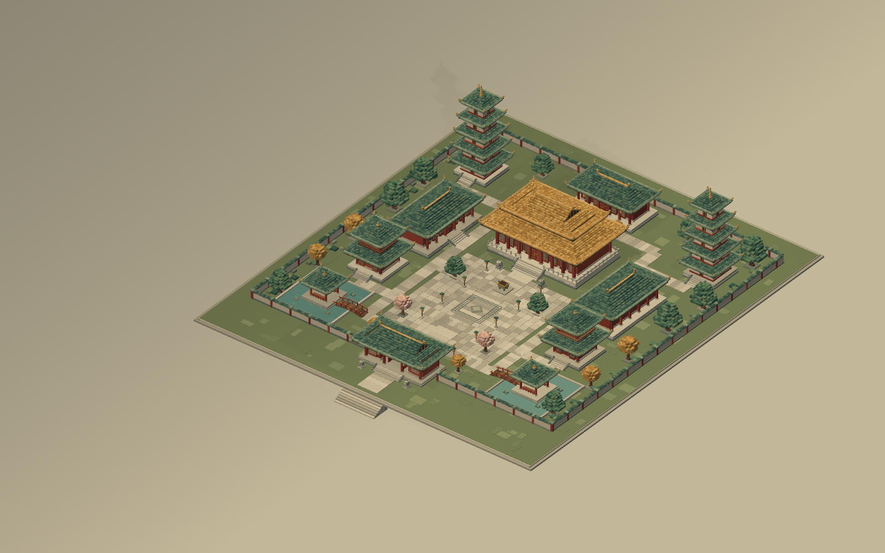

# 云阙 · 方寸山河

**一个无需后端的 Three.js 体素中国古典建筑群。** 原生 JavaScript、程序化建筑、可交互鸟瞰、晨曦 / 日暮 / 月夜三种光影。

> **接入本站后的验证（2026-09-25）**：本地离线构建已在 Chromium 中实际打开，Three.js 场景正常显示且页面进入 `ready` 状态；[封面](docs/cover.png)来自该次浏览器截图。

11 座建筑围绕南北中轴组织。页面载入后直接展开全景，没有开始按钮、登录、模型下载或进入场景的额外步骤。工程内的场景不是一张图片，所有建筑均由可从任意角度观察的三维构件组成。

## 安装与启动

环境要求：Node.js 20 或以上；浏览器支持 ES modules、import maps 和 WebGL 2，并开启硬件加速。

解压后，在项目目录执行：

```bash
cd yunque-voxel
npm install
npm run dev
```

浏览器打开：

```text
http://127.0.0.1:5173
```

`npm install` 安装固定版本 `three@0.180.0`。开发服务器检测到该依赖后，自动改用本地引擎文件，页面运行不再访问 CDN。**请使用 HTTP 服务，不要双击 HTML 以 `file://` 打开。**

换端口或允许同一局域网设备访问：

```bash
npm run dev -- --port 5180
npm run dev -- --host 0.0.0.0 --port 5173
```

若暂时没有安装依赖，也可以先 `npm run dev`；此时浏览器必须能够访问 jsDelivr，页面会从 CDN 载入固定版本的 Three.js。安装依赖后请重启开发服务器。

## 构建与部署

推荐构建一个不依赖运行时网络的版本：

```bash
npm install
npm run build -- --offline
npm run preview
```

预览地址：

```text
http://127.0.0.1:4173
```

`--offline` 是严格模式：依赖未安装时会明确报错，而不会悄悄生成 CDN 版本。普通 `npm run build` 会在依赖存在时生成本地版本，在依赖缺失时生成 CDN 版本并输出警告。

将完整 `dist/` 目录放到任何静态站点服务即可；入口是 `dist/index.html`，资源路径均为相对路径，支持子目录部署。应用没有后端 API。Node 脚本只负责本地静态文件服务、校验和复制构建资源，不参与部署后的场景渲染。

检查 `dist/build-info.json`：`offline: true` 表示引擎已复制进 `dist/vendor/`，`offline: false` 表示运行时需要 CDN。随本次交付附带的构建为后者。

## 场景内容

| 类型 | 建筑 | 布局与形制 |
| --- | --- | --- |
| 主殿 | 云阙大殿 | 中轴核心，金色重檐、上层歇山式山花、白石高台 |
| 后殿 | 藏经阁 | 主殿后方的安静院落，青瓦、木格窗 |
| 东西配殿 | 文华殿、崇礼殿 | 面向中庭，镜像布置，体量低于主殿 |
| 山门 | 云阙山门 | 南侧入口，中央门洞通透，两侧石狮 |
| 钟鼓楼 | 钟楼、鼓楼 | 两层开敞楼阁，内部有体素铜钟 / 木鼓 |
| 双塔 | 栖云塔、照月塔 | 后院两侧，五层收分、层檐与金色塔刹 |
| 双亭 | 听雨亭、观澜亭 | 前庭方池之上，攒尖式屋顶与木桥 |

建筑位置、尺寸与东西朝向成对对称；钟鼓功能、树色和瓦面色差允许局部差异。规划屋顶包围矩形之间至少留出 3 个世界单位的间隔。道路连接入口、门洞、主庭、配殿、塔楼以及桥与台阶落点；可从主殿两侧绕行进入后院。

屋面不是倾斜的光滑薄片：曲面高度经过采样与量化，以离散瓦块、凸起瓦垄、屋脊饰件和翘角收边形成体素轮廓。场景含庑殿式四坡屋面、歇山式上部山花和攒尖式方亭 / 塔檐的风格化表达；不是某一座真实寺院的测绘复原。

构件包括朱红立柱、叠置斗拱、木梁、门钉、木格窗、灯笼、石阶、栏杆、4 尊石狮和香炉。环境含 22 棵体素庭树、青石铺装、草地、围墙、双池、荷叶、木桥、微量飘尘和香烟。匾额贴图由浏览器 Canvas 即时生成，字体使用系统字体，工程没有外部模型、图片贴图或网络字体依赖。

## 操作

鼠标左键拖动旋转，滚轮缩放，右键拖动平移。触屏单指旋转、双指缩放和平移。点击建筑、建筑标签或右下角导览图可走近建筑并查看介绍。

| 操作 | 控件 / 快捷键 |
| --- | --- |
| 晨曦、日暮、月夜 | 底部三段按钮 / `1`、`2`、`3` |
| 自动环绕巡游 | 巡游按钮 / `Space` |
| 回到全景 | 复位按钮 / `H` |
| 显示建筑标签 | 标签按钮 / `L` |
| 保存当前三维画面为 PNG | 相机按钮 / `P`，导出不含 HTML 界面 |
| 画质切换 | 左下角“自动画质”，循环自动 / 高画质 / 流畅优先 |
| 全屏与帮助 | 全屏按钮、右上角 `?` |

键盘焦点、按钮状态、触摸操作和系统“减少动态效果”偏好都有处理。离开页面时暂停动画；初次显示不自动巡游，以便立即观察全貌。

## 性能设计与实测方法

默认种子生成 **28,194 个长方体体素构件**，共享一份 `BoxGeometry`，按表面类型归入 **5 个 InstancedMesh 批次**。匾额、地平面、粒子和选中轮廓另有少量绘制；**5 个实例批次不等于整帧只有 5 次 draw call**。体素本体共 338,328 个三角形，不含其他对象，也不是已实测 GPU 耗时。

阴影只由一个平行光产生，静态阴影贴图可在旋转镜头时复用。四盏局部暖光不投射阴影。程序限制渲染像素总量和 DPR，自动模式在持续低帧率时降低分辨率。建筑拾取只计算 11 个建筑包围盒，不逐一检查 28,194 个实例。几何只在初始化时生成，不在每帧重建。

默认目标是具备硬件加速的桌面浏览器稳定 ≥30 FPS；**此目标尚未在本次环境中完成实测验收**。实际表现与 GPU、浏览器、分辨率和缩放程度有关。

本地运行后，保持页面可见，等待首帧及自动画质调整稳定，在浏览器控制台执行：

```js
// 当前引擎、体素数、绘制次数、渲染分辨率及帧时统计
window.__YUNQUE__.getStats();

// 30 秒自动旋转，使用固定的测试转速；测试后恢复之前的巡游状态和转速
const result = await window.__YUNQUE__.benchmark({
  seconds: 30,
  rotate: true,
  rotateSpeed: 2,
});
console.table(result);
```

结果包含 `averageFPS`、`p95FrameMs`、`resolution`、`renderer`、画质与主题。应同时观察平均帧率与长帧，而不是只读一个瞬时 FPS 数字。建议在晨曦、日暮、月夜分别测试，并保留设备及分辨率信息；平均 ≥30 FPS 且 P95 帧时接近或低于 33.3 毫秒可作为参考检查项。该函数统计浏览器 `requestAnimationFrame` 回调间隔，并非 GPU 时间查询。

其他调试入口：

```js
window.__YUNQUE__.setTheme('night');
window.__YUNQUE__.setQuality('performance');
window.__YUNQUE__.focusBuilding('main');
window.__YUNQUE__.reset();
```

## 工程结构

```text
yunque-voxel/
├── index.html                  # 页面、界面与引擎 import map
├── package.json                # 固定 Three.js 版本、命令
├── src/
│   ├── boot.js                 # 异步引擎启动与错误提示
│   ├── main.js                 # Three.js 渲染、镜头、光影、交互、性能统计
│   ├── scene-data.js           # 与渲染器分离的程序化建筑与景观生成
│   ├── layout.js               # 11 座建筑配置与道路连接图
│   ├── palette.js              # 材质色板与固定种子随机数
│   └── style.css              # 响应式中文界面与三套主题
├── public/favicon.svg
├── scripts/
│   ├── serve.mjs               # 本地静态文件服务
│   ├── build.mjs               # 静态构建；支持严格离线模式
│   └── engine.mjs              # 本地引擎检测与 import map 处理
├── docs/                      # 作品封面与几何预览
├── dist/                      # 已生成的 CDN 模式静态站点
├── LICENSE
└── THIRD_PARTY_NOTICES.md
```

## 修改与扩展

在 `src/layout.js` 中修改建筑位置、体量、朝向、名称和导览文字，配合 `src/scene-data.js` 中相应建筑生成器扩展几何。添加建筑时同步增加道路连接节点、边与对应庭院铺装，并维护镜像配对；界面数量也需要同步更新。

屋顶曲率、翘角和瓦块粒度集中在 `scene-data.js` 的 `roof()`；`palette.js` 控制瓦色、墙色、木色与树冠色；`main.js` 的 `THEMES` 控制三种光影。默认随机种子固定，便于对比修改前后的形态。

## 几何预览

下面的图片使用**同一份程序化场景数据，经离线 VTK 渲染器生成，仅用于检查布局与体素几何**。它不是 Three.js 运行截图，不含正式网页界面、Canvas 匾额和 Three.js 的最终光照效果，也不构成帧率证据。



## 许可

本项目原创代码采用 MIT 许可。Three.js 的许可保留在其 npm 包中；本地构建时会同时复制至 `dist/vendor/LICENSE`。未附带系统字体文件。第三方说明见 [THIRD_PARTY_NOTICES.md](THIRD_PARTY_NOTICES.md)。
