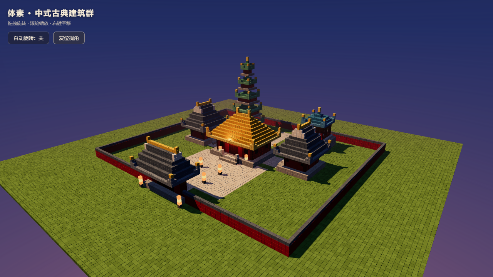

# 体素 · 中国古典建筑群（Voxel Chinese Temple Complex）



一个用 **Three.js + Vite** 实现的 3D 体素（Minecraft 风格）中式古典建筑群场景，浏览器打开即可漫游。

## 场景构成

| 建筑 | 位置 | 屋顶形制 | 说明 |
| --- | --- | --- | --- |
| 山门 | 场地前端（南墙正中） | 歇山顶 · 青瓦 | 三门洞，入口 |
| 主殿 | 中轴线核心 | 庑殿顶 · 琉璃黄 | 体量最大，居中 |
| 西配殿 | 主殿西侧（朝向庭院） | 歇山顶 · 青瓦 | 对称分布 |
| 东配殿 | 主殿东侧（朝向庭院） | 歇山顶 · 青瓦 | 对称分布 |
| 宝塔 | 西北角 | 攒尖顶 · 琉璃绿 | 五层塔 |
| 钟楼 | 东北角 | 攒尖顶 · 琉璃蓝 | 对称亭阁 |

- **布局**：中轴对称院落，山门 → 前院广场 → 主殿 → 后院 → 宝塔/钟楼，石板甬道与广场贯穿动线，红墙围墙合院。
- **细节**：飞檐翘角（檐口连续上挑）、斗拱、立柱、额枋、台阶、隔扇门窗、白色山花、石狮、石灯、灯笼（自发光）。
- **环境**：草地 + 石板铺装，黄昏暖阳 + 半球环境光 + 阴影，渐变天空与雾效。

## 技术要点

- 体素块按颜色分组 `THREE.InstancedMesh` 渲染：**33,513 个体素块仅约 15 次 draw call**。
- 每块随机微调明度呈现块面质感；纯几何 + 顶点色，无贴图、无后端。
- 实测帧率 **180 FPS**（远高于 30 FPS 要求，受显示器刷新率限制）。

## 运行方式

```bash
# 安装依赖
npm install

# 开发模式（默认 http://localhost:5173，若被占用会自动换端口）
npm run dev

# 生产构建
npm run build

# 预览构建产物
npm run preview
```

> 说明：本机沙箱中安装时若 esbuild/rollup 的平台二进制被跳过，可执行
> `npm install --ignore-scripts --no-save @esbuild/win32-x64@0.21.5 @rollup/rollup-win32-x64-msvc@4.63.5`
> 补齐（正常环境无需此步）。

## 操作

- 拖拽旋转视角 · 滚轮缩放 · 右键平移
- 左上角按钮可切换「自动旋转」与「复位视角」；页面打开即为缓慢巡游状态
