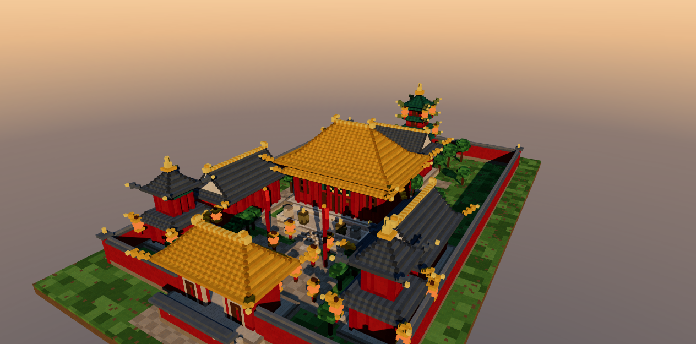

# 古城 · 体素中式建筑群 / Voxel Chinese Courtyard

用 **Three.js** 从零生成的体素（Minecraft 方块风格）中国古典建筑群。浏览器打开即进入场景，
镜头自动环绕，无需任何操作即可看到全貌。



---

## 运行方式

```bash
npm install          # 安装依赖（three + vite）
npm run dev          # 开发模式，默认 http://localhost:5173
npm run build        # 生产构建，输出到 dist/
npm run preview      # 预览构建产物，默认 http://localhost:4173
```

> 构建产物 `dist/` 是纯静态文件，也可以直接丢到任意静态服务器 / 本地 `npx serve dist`。
> 依赖 Node ≥ 18（已验证环境 Node 22.22.2 / npm 10.9.7）。

---

## 场景构成

场地 132 × 210 体素，**严格中轴对称**（对称面 x = 0），八座建筑分五进院落沿中轴展开：

| 建筑 | 位置 (x, z) | 形制 | 脊高 |
|---|---|---|---|
| 山门 | (0, +67) | 庑殿顶，三门洞（中门通行、两侧板门）、匾额、石券脸 | 30 |
| 钟楼 / 鼓楼 | (±44, +50) | 二层楼阁 + 腰檐 + 攒尖顶，内置钟 / 鼓 | 38 |
| 东西配殿 | (±40, +20) | 歇山顶（纵脊），面朝中轴，各带廊柱 | 29 |
| **主殿** | (0, −8) | **重檐庑殿顶**（最高等级），月台 + 御路踏道 + 栏杆 + 周匝廊柱 | 43 |
| 后殿 | (0, −56) | 歇山顶 | 29 |
| 宝塔 | (0, −83) | 五层密檐式，绿琉璃瓦，逐层飞檐 + 角灯 | 47 |

**空间与动线**：山门（三门洞）→ 前院（钟鼓楼、幡杆、灯杆）→ 配殿院落 → 主殿月台（御路踏道）
→ 后院 → 后殿 → 塔院。全院由红墙 + 青瓦压顶围合，山门外设照壁与石狮一对。
地面按功能区分：中轴御道、甬路铺砖（带勾缝色差）、其余为草地（3 级明暗 + 泥土斑点）。

**建筑细节**：飞檐翘角（四角沿对角线逐层外扩抬高 + 套兽）、斗拱层（红绿相间彩画带）、
朱红立柱与廊柱、直棂窗 / 隔扇门 / 门钉 / 匾额、须弥座与栏杆、石狮、香炉、灯笼、瓦垄明暗纹理。

---

## 技术要点

- **体素引擎**（`src/voxel.js`）
  - `Map` 去重写入 → 生成前剔除「六面全被占据」的内部体素（本例 12.96 万 → 8.54 万，**省 33%**）
  - 单一 `BoxGeometry` + `InstancedMesh`，实体全场 **1 次 draw call**（灯笼自发光单独 1 次，天空背景 1 次，共 3 次）
  - 逐体素颜色用 `instanceColor`，叠加坐标散列的明暗抖动与侧面遮挡 AO，得到 Minecraft 质感的色彩层次
- **屋顶生成器**（`src/roof.js`）：庑殿顶 / 歇山顶 / 攒尖顶 / 腰檐统一由「逐层收缩序列」驱动，
  `shrinks: [3,2,2,1]` 实现**举折曲线**（檐口平缓、近脊陡峭）；歇山以上部冻结纵向尺寸 + 山花封板实现；
  `ridgeAxis` 控制正脊方向（配殿为纵脊）
- **构件库**（`src/parts.js` / `src/props.js`）：台基、踏道 + 御路、栏杆、墙身（含角柱/墙裙/门窗自动排布）、
  廊柱、灯笼、石狮、香炉、树木、幡杆
- **光影**：单向光（阴影）+ 半球光 + 补光 + 8 盏灯笼点光源；`PCFSoft` 4096 阴影贴图，
  正交阴影相机覆盖全场；场景静态 → 阴影贴图**只烘焙一次**（`shadowMap.autoUpdate = false`）
- **氛围**：三段式渐变天空（CanvasTexture 等距柱状映射）+ 线性雾 + ACES Filmic 色调映射，
  晨曦 / 正午 / 黄昏三套光照与天空预设
- **性能守卫**：HUD 实时 FPS；若连续低于 34fps 自动降级（先降像素比，再关阴影）

---

## 实测结果

在 **RTX 5070 Ti / Chrome headless（ANGLE D3D11）** 下用 CDP 实读页面内 FPS 计数：

```
FPS       180（无垂直同步上限；真实浏览器受刷新率限制 → 60fps）
draw calls 3
triangles  1,024,644
voxels     85,386（生成 129,592，剔除内部 44,206）
构建耗时   323 ms（含全部几何生成与体素化）
```

帧率远超要求的 30fps。`npm run build` 通过（15 modules，产物 519 KB / gzip 134 KB）；
`npm run dev` 与 `npm run preview` 均已实跑验证。

---

## 交互

| 操作 | 效果 |
|---|---|
| 拖拽 / 滚轮 / 右键拖动 | 旋转 / 缩放 / 平移（松手 6s 后自动恢复环绕） |
| 晨曦 · 正午 · 黄昏 | 切换太阳角度、色温、天空、雾、灯笼亮度 |
| 全景 · 中轴 · 俯瞰 · 主殿 · 宝塔 | 机位推轨（1.35s 缓动） |
| 旋转 | 开关自动环绕 |

**URL 参数**（可深链 / 截图）：

```
?time=dawn|noon|dusk      时段
&view=panorama|axis|top|hall|pagoda   机位
&spin=0                   关闭自动环绕
&intro=0                  跳过开场推轨
&still=1                  渲染数帧后停止（截图 / 缩略图用）
&shot=1                   额外把画布导出为 dataURL（自动化验收用）
```

例：`http://localhost:5173/?time=dusk&view=axis&spin=0`

---

## 项目结构

```
├─ index.html          页面骨架 + HUD（暗色玻璃面板）
├─ vite.config.js
├─ src/
│  ├─ main.js          渲染器、光影、时段/机位预设、交互、渲染循环
│  ├─ voxel.js         体素写入器 + 内部剔除 + 实例化网格
│  ├─ layout.js        总平面数据（单一数据源）
│  ├─ roof.js          屋顶形制生成器（庑殿/歇山/攒尖/腰檐/翘角/正脊）
│  ├─ parts.js         建筑构件（台基/踏道/栏杆/墙身/门窗/廊柱/月台/铺装）
│  ├─ buildings.js     山门、主殿、配殿、后殿
│  ├─ towers.js        钟鼓楼、宝塔
│  ├─ site.js          地面、铺装、围墙、照壁、绿化与小品
│  ├─ props.js         灯笼、石狮、香炉、树木、幡杆
│  └─ palette.js       配色板
└─ tools/              验证脚本（非运行依赖）
   ├─ smoke.mjs        纯 Node 跑一遍体素生成，输出各阶段用量与耗时
   ├─ grab.mjs         无头 Chrome 渲染 + 画布抓帧（截图验收）
   └─ bench.mjs        CDP 连接页面，实读 FPS / draw call / GPU 型号
```

---

## 说明

- 全部几何由代码程序化生成，**无任何外部模型 / 贴图资源**，单文件产物离线可跑。
- `tools/*.mjs` 只用于开发期验收，可删除，不影响构建与运行。
