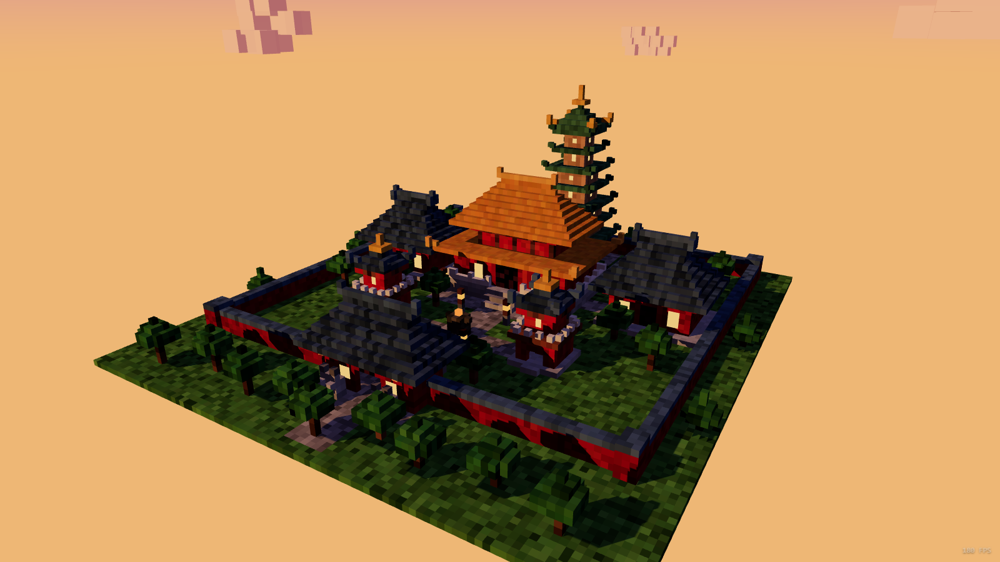

# 体素古刹 · Voxel Chinese Temple

一个用 **Three.js** 实现的 3D 体素(Minecraft 风格)中国古典建筑群场景,浏览器打开即可观看,
无需任何操作即自动进入晨昏光影中的寺院全貌,并缓慢环绕展示。



## 运行方式

```bash
npm install     # 安装依赖(three + vite)
npm run dev     # 开发模式,默认 http://127.0.0.1:5173/(若被占用会自动换端口,以终端输出为准)
```

生产构建与本地预览:

```bash
npm run build   # 产物输出到 dist/
npm run preview # 本地预览生产构建
```

要求 Node.js ≥ 18。无后端、无外部资源,全部体素在运行时程序化生成。

## 操作

- 打开页面:2 秒开场运镜后进入自动环绕展示
- 鼠标左键拖动旋转,滚轮缩放,右键平移;左下角有操作提示,右下角实时 FPS

## 场景布局(中轴对称院落)

沿南北中轴依次展开:山门 → 前庭(钟楼/鼓楼对称分列)→ 主殿 → 后部宝塔。

| 建筑 | 形制 | 说明 |
| --- | --- | --- |
| 主殿 | 重檐庑殿顶,琉璃黄瓦 | 体量最大,居中轴核心,白石台基 + 三阶踏步 + 望柱栏杆 |
| 配殿 ×2 | 单檐歇山顶(带搏风板),青瓦 | 对称分布于主殿两侧 |
| 山门 | 城门式,庑殿顶 | 中开券洞,金匾、檐角挂灯笼,门前石狮一对 |
| 宝塔 | 七层楼阁式,绿琉璃平座檐 | 中轴后部,攒尖顶 + 金色塔刹,每层发光窗 |
| 钟楼 / 鼓楼 | 两重檐攒尖方亭 | 前庭对称分列,内置钟/鼓,平座栏杆 |

环境细节:红墙金瓦青瓦配色、斗拱带、立柱、格子窗(黄昏自发光)、灯笼柱、
香炉、石狮、院墙与角墩、铺装道路与草地、体素树、漂浮体素云;
 Shader 渐变晨昏天空 + 落日余晖、平行光长投影 + 半球环境光 + 冷色补光、距离雾。

## 技术要点

- **InstancedMesh 实例化**:全部体素合并为 2 个 InstancedMesh(普通/自发光),仅 2 次 draw call
- **隐藏体素剔除**:6 面被包裹的体素不生成实例,本场景 26,682 个体素实际绘制 21,161 个
- **静态阴影贴图**:场景除云外完全静态,阴影贴图只渲染一次(`shadowMap.autoUpdate = false`)
- **逐体素颜色抖动**:种子随机 HSL 微扰,营造手搭体素的颗粒质感
- **自定义天空 Shader**:紫→橙晨昏渐变 + 太阳辉光,手动附加 tonemapping/colorspace 输出
- 实测性能:1600×900、像素比 2 下稳定 **180 FPS**(要求 ≥30)

## 目录结构

```
voxel-chinese-temple/
├── index.html          # 入口页面(HUD / FPS)
├── package.json
├── vite.config.js
└── src/
    ├── main.js         # 渲染器、光照、天空、相机运镜、云、主循环
    ├── world.js        # 体素世界:存储、剔除、InstancedMesh 构建
    ├── palette.js      # 中式建筑调色板
    └── builders.js     # 建筑与场景生成(主殿/配殿/山门/宝塔/钟鼓楼/环境)
```

控制台调试工具:`__view(x, y, z, tx, ty, tz)` 可直接把相机放到任意位置。
