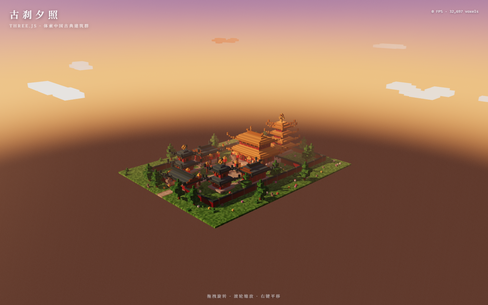

# 古刹夕照 · 体素中国古典建筑群（Three.js）

用 Three.js 实现的 **Minecraft 体素风格中国古典建筑群**，中轴对称的院落式布局，
黄昏暖阳下渲染，浏览器打开即可自动环视全貌。



## 运行方式

需要 Node.js ≥ 18（开发环境实测 Node 24 / npm 11）。

```bash
# 1. 安装依赖
npm install

# 2. 开发模式启动（默认 http://localhost:5173）
npm run dev

# —— 或者：生产构建 + 本地预览（实测使用的方式）
npm run build
npm run preview      # http://localhost:4173
```

页面打开后 **无需任何操作**：先有约 3.4 秒的远景推镜入场动画，
随后相机自动缓慢环绕建筑群；拖拽旋转 / 滚轮缩放 / 右键平移随时接管。

## 场景内容

中轴线上自南向北（七座建筑，主次分明）：

| 建筑 | 形制 | 说明 |
| --- | --- | --- |
| 山门 | 悬山顶（青瓦） | 前端入口，门道贯穿可通行，悬匾、门内红灯笼 |
| 钟楼 / 鼓楼 | 两层攒尖顶（青瓦） | 一进院东西对称，二层暗龛内可见铜钟/立鼓 |
| 东 / 西配殿 | 歇山顶（青瓦） | 长轴沿中轴纵深，殿门朝向中央庭院 |
| **主殿** | **重檐庑殿顶（金琉璃瓦）** | 中轴核心，体量最大：须弥座台基、石栏、月台台阶、斗拱、匾额、檐角灯笼 |
| 宝塔 | 楼阁式五层出檐（金瓦）+ 塔刹 | 最北塔院，全场最高，相轮刹杆 |

环境与细节：

- **动线**：中轴御道（山门 → 庭院 → 主殿 → 塔院），支路通往配殿与钟鼓楼，庭院方砖铺装带镶边
- **院墙**：红墙青瓦压顶围合，塔院隔墙带门洞小檐
- **小品**：石狮两对（山门/主殿阶前，雄狮踏绣球）、灯柱灯笼、庭院铜香炉、体素松、花灌木山石
- **氛围**：黄昏渐变天穹（着色器球）+ 西南低角度暖阳定向光（2048 阴影贴图）+ 灯笼点光 + 飘动体素云 + 雾

## 屋顶算法

`src/roofs.js` 中的 `addRoof()` 用**分层叠涩**生成中式曲面屋顶：

- 每层内收量按 `t^p`（p>1）插值 → 檐缓脊陡的**凹曲屋面**；
- 四角沿 45° 阶梯出挑上翘 → **飞檐翘角**；
- 参数化收进目标即可派生各种形制：庑殿（收成正脊 + 鸱吻）、悬山（山面不收 + 山花）、
  歇山（脊缩短 + 山花）、攒尖（收成宝顶）、重檐下檐 / 腰檐（收到上层墙身即停）。

## 性能

- 全场景约 **3.3 万个体素合并为 1 个 `InstancedMesh`** —— 主绘制 1 次 + 阴影 1 次，
  另有约 10 朵小体量体素云；
- 实测（1440×900、像素比 ≤ 2、PCFSoft 阴影）：**150~183 FPS**，
  旋转/缩放全程流畅，远高于 30 FPS 的要求；右上角有实时 FPS 与体素计数。

## 项目结构

```
├── index.html          # 页面与 HUD（标题/FPS/操作提示）
├── vite.config.js
└── src/
    ├── main.js         # 渲染器、相机、光照、入场动画、主循环
    ├── builder.js      # VoxelWorld：体素收集 → 单 InstancedMesh
    ├── palette.js      # 中国古建配色
    ├── roofs.js        # 叠涩 + 飞檐翘角屋顶算法（各形制）
    ├── buildings.js    # 主殿/山门/钟鼓楼/配殿/宝塔 + 门窗斗拱灯笼石狮松树
    ├── site.js         # 地面铺装、院墙、道路动线、绿化小品
    └── sky.js          # 黄昏天穹着色器 + 飘动体素云
```

## 依赖

- [three](https://www.npmjs.com/package/three) ^0.180（含 OrbitControls）
- [vite](https://www.npmjs.com/package/vite) ^5
