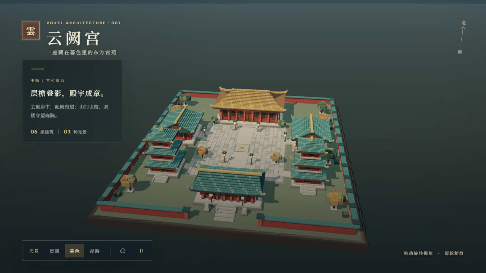

# 云阙宫 · Voxel Palace

一个无需后端的 Three.js 体素风格中国古典建筑群。场景包含主殿、两座配殿、山门与对称的钟鼓楼，共六座建筑，并配有铺装庭院、院墙、植被、石狮、灯笼及晨曦／暮色／夜游光照。



## 运行

需要 Node.js 20.19+ 或 22.12+。

```bash
npm install
npm run dev
```

在浏览器打开终端显示的本地地址（通常为 `http://localhost:5173`）。生产构建：

```bash
npm run build
npm run preview
```

## 操作

- 鼠标拖动旋转，滚轮缩放；触屏单指旋转、双指缩放。
- 底部按钮切换晨曦、暮色和夜游；可重置视角和暂停缓慢的自动旋转。

## 实现

建筑、屋瓦、道路和植物均由程序生成的方块组成。相同材质的方块合并为 `InstancedMesh`，减少绘制调用；阴影贴图与像素比按设备能力调整。场景不依赖图片贴图或后端。
