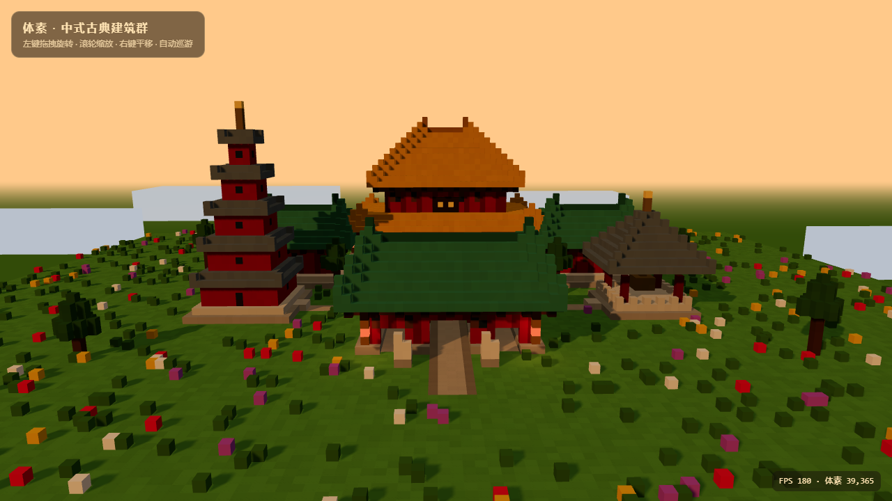

# 体素 · 中式古典建筑群 (Voxel Chinese Classical Architecture)

用 Three.js 实现的 Minecraft 体素块风格中国古典建筑群场景，黄昏光影，浏览器打开即可观看。



## 场景内容

中轴对称院落布局，共 6 座建筑 + 环境小品：

| 建筑 | 位置 | 形制 |
|------|------|------|
| **主殿** | 中轴线北端（核心） | 三层台基 + 副阶廊柱 + 重檐庑殿顶（黄琉璃瓦），栏杆望柱、斗拱、鸱吻 |
| **配殿 ×2** | 主殿前东西对称 | 歇山顶（绿琉璃瓦），门朝中轴 |
| **山门** | 场地南端入口 | 歇山顶三门洞（中门贯通，御道穿门而过），门前石狮一对 |
| **宝塔** | 西侧 | 五层密檐 + 攒尖塔刹（青瓦），与钟楼呼应 |
| **钟楼** | 东侧 | 四柱亭式 + 铜钟 + 攒尖顶 |

环境与细节：
- **道路动线**：山门 → 中轴御道 → 庭院（方砖墁地）→ 主殿台阶，另有甬路通向配殿 / 宝塔 / 钟楼
- **小品**：庭院香炉、石灯笼（发光）、檐下挂灯（暖色点光源）、体素松树、野花草丛
- **光影**：黄昏低角度暖阳（2048 阴影贴图）、长影、暖色雾、落日圆盘、远景山峦与体素云
- 地面为草地 + 铺装混合，建筑通过台基 / 台阶与地面自然衔接

## 运行方式

无需构建，任意静态文件服务器即可（ES Module 需经 http 访问）：

```bash
# 方式一：Python（无需安装任何东西）
python -m http.server 8123 --directory voxel-china

# 方式二：Node
npx serve voxel-china
```

然后浏览器打开 `http://localhost:8123/`。

Three.js（r160）已下载到 `vendor/` 本地目录，**完全离线可用**。

## 操作

- 左键拖拽：旋转视角
- 滚轮：缩放
- 右键拖拽：平移
- 默认自动巡游，拖拽后停止

## 技术要点

- **纯原生 Three.js**，无框架无构建步骤，`index.html` + `main.js` 两个文件
- 全部体素合并为 **3 个 `InstancedMesh`**（主体 / 发光体 / 天空远景），约 **39,365 个体素块**，整帧仅 3~4 个 draw call
- 实测帧率 **~180 FPS**（右下角实时显示 FPS 与体素数），远超 30 FPS 要求
- 屋顶参数化生成：庑殿顶（四边同步内收）、歇山顶（长边隔层内收）、攒尖顶（内收至尖 + 塔刹），檐角逐级抬升形成飞檐翘角
- 每体素颜色抖动（hash 噪声）模拟手工方块质感；ACES 色调映射 + PCF 软阴影

## 项目结构

```
voxel-china/
├── index.html            # 页面入口（importmap 指向本地 vendor）
├── main.js               # 场景全部代码（体素生成 + 渲染）
├── vendor/
│   ├── three.module.js   # Three.js r160
│   └── OrbitControls.js  # 轨道控制器
├── screenshots/          # 实拍效果图
└── README.md
```
