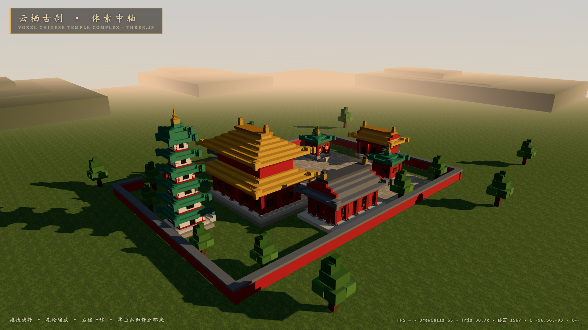

# 云栖古刹 · 体素中轴 — Voxel Chinese Temple Complex

模型：MiMo V2.6 Flash。本目录从用户提供的 `voxel-chinese-temple.7z` 整理而来；压缩包未附提示词差异说明。

用 **Three.js** 实现的 3D 体素（Voxel）风格中国古典建筑群，Minecraft 式方块拼接，
纯前端、无后端，浏览器打开即进入场景并自动环绕展示全貌。



## 场景内容

中轴对称的院落布局，共 **7 座建筑**（南→北）：

| 建筑 | 位置 | 屋顶形制 | 屋面 |
|------|------|----------|------|
| 山门（云栖禅寺） | 南端入口 | 歇山顶 | 黄琉璃 |
| 钟楼 / 鼓楼 | 山门内两侧对峙 | 攒尖顶 | 绿琉璃 |
| 东配殿（普贤殿）/ 西配殿（文殊殿） | 庭院东西对称 | 歇山顶 | 青瓦 |
| 主殿（大雄宝殿） | 中轴核心 | 重檐庑殿顶 | 黄琉璃 |
| 宝塔（六层楼阁式） | 北端压轴 | 逐层塔檐 + 攒尖顶 | 绿琉璃 |

配套细节：红院墙 + 青瓦压顶、中轴神道（双色石板）、庭院铺装、汉白玉栏杆与台阶、
斗拱（青绿点金双层）、直棂门窗、匾额（Canvas 楷体金字）、灯笼（自发光 + 暖光点光源）、
石狮一对、铜钟 / 大鼓、香炉与飘动香烟、程序化草地/石板纹理、晨昏光色与远山薄雾。

## 运行方式

要求：Node.js ≥ 18（开发时使用 Node 24 / npm 11）。

```bash
# 1. 安装依赖
npm install

# 2a. 开发模式（热更新，浏览器访问打印的本地地址）
npm run dev

# 2b. 生产构建 → dist/index.html（完全内联的单文件）
npm run build

# 2c. 构建产物也可用本地服务器查看
npm run preview
```

**无需服务器的最简方式**：`npm run build` 后直接**双击打开 `dist/index.html`** 即可观看
（Three.js 与全部资源已内联，仅需现代浏览器 + WebGL）。

### 操作与深链

- 拖拽旋转 · 滚轮缩放 · 右键平移 · 单击画面停止自动环绕
- 定点视角深链（`#` 或 `?v=` 均可）：
  `#gate` 山门 · `#main` 主殿 · `#side` 配殿 · `#towers` 钟鼓楼 · `#pagoda` 宝塔 · `#top` 俯瞰 · `#front` 正南立面
  例：`dist/index.html#pagoda`

## 项目结构

```
voxel-chinese-temple/
├── index.html            # 页面入口（HUD 叠层）
├── vite.config.js        # Vite + vite-plugin-singlefile（单文件构建）
├── package.json
├── src/
│   ├── main.js           # 渲染器/相机/光照/动画循环/深链视角
│   ├── voxel.js          # VoxelBuilder：方块按材质分桶 → 合并网格
│   ├── roofs.js          # 屋顶生成：庑殿/歇山/攒尖/塔檐/飞檐翘角
│   ├── details.js        # 立柱·斗拱·直棂门窗·台阶·灯笼·栏杆·匾额
│   ├── buildings.js      # 山门/主殿/配殿/钟鼓楼/宝塔 五类建筑
│   ├── environment.js    # 地面/神道/院墙/树木/石狮/香炉/远山/香烟
│   ├── materials.js      # 材质调色盘 + 程序化画布纹理（草/石板/匾额/天空）
│   └── style.css         # 界面样式
└── screenshots/          # 实测截图
```

## 技术要点与实测结果

- **性能**：全部体素按材质合并，场景仅 **~1,570 个体素方块 → 约 3.9 万三角形、
  60 余个绘制调用（含阴影 pass）**，任何独显/核显均远超 30fps；HUD 右下角实时显示
  FPS / DrawCalls / 三角形数。
  （无头 SwiftShader 软件渲染下 FPS 数值无参考意义，故以 DrawCalls/三角形数为准。）
- **阴影**：2048 PCFSoft 方向光阴影，晨昏低角度长影；半球光 + 环境光补暗部；
  ACES 色调映射，暖雾融入天际线。
- **中式形制**：屋顶按"层高 1、每侧收 2"生成约 1:2 举折坡度，歇山顶露出红色山花，
  檐角以外挑方块 + 两级垫块模拟飞檐翘角，正脊两端置鎏金鸱吻。
- **无外部资源**：纹理全部由 Canvas 程序化生成，可完全离线运行。

### 实测（2026-09-25）

- `npm run build` 构建通过，产物 `dist/index.html` ≈ 569 KB（单文件内联）。
- 无头 Edge 对 7 个视角（全景/山门/主殿/配殿/钟鼓楼/宝塔/俯瞰）逐一截图验收，
  HUD 相机坐标与画面一致，见 `screenshots/`。
