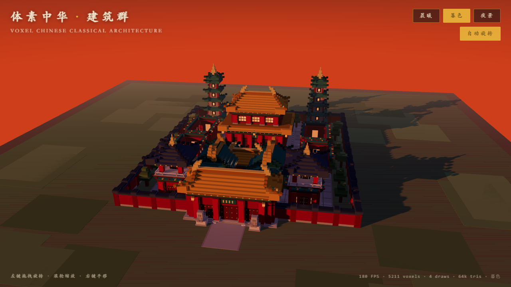
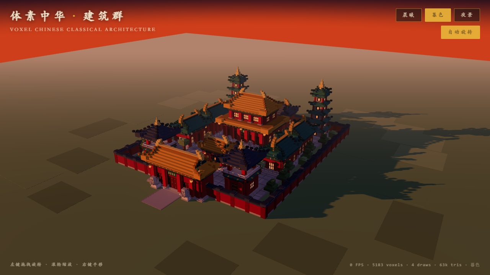
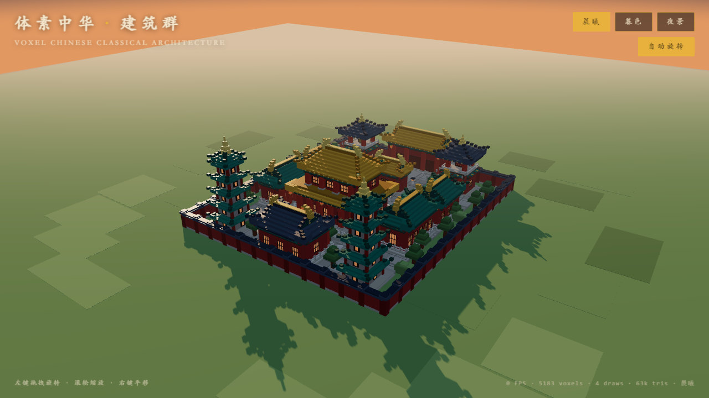

# 体素中华 · 中国古典建筑群（Three.js Voxel）

3D 体素（Voxel）风格的中国古典建筑群场景：中轴对称三进院落，主殿、配殿、山门、垂花门、
钟鼓楼、双塔一应俱全，飞檐翘角、斗拱立柱、红墙琉璃瓦、石狮灯笼，晨昏光影氛围。
纯前端实现，无需后端，页面打开即入景。



## 运行方式

环境要求：Node.js ≥ 18（实测 Node 24 / npm 11）

```bash
# 1. 安装依赖
npm install

# 2. 启动开发服务器（默认 http://localhost:5173）
npm run dev

# 3. 生产构建（产物输出到 dist/）
npm run build

# 4. 本地预览构建产物
npm run preview
```

## 操作说明

| 操作 | 说明 |
| --- | --- |
| 左键拖拽 | 旋转视角 |
| 滚轮 | 缩放 |
| 右键拖拽 | 平移 |
| 「晨曦 / 暮色 / 夜景」 | 三套光照氛围一键切换（默认**暮色**） |
| 「自动旋转」 | 开关视角缓慢环绕（打开页面即自动环游全貌） |

右下角实时显示帧率、体素数、绘制调用与三角形数。

| 暮色 | 夜景 |
| --- | --- |
|  |  |

## 场景内容

**建筑（12 座，中轴对称）**

- **主殿**：重檐庑殿顶 · 黄琉璃瓦 · 五开间 · 须弥台基 · 石栏板 · 三出踏跺（含御道）· 匾额
- **东/西厢房**：歇山顶 · 绿琉璃 · 三开间（主院两侧）
- **东/西配殿**：歇山顶 · 绿琉璃 · 五开间（主殿两侧）
- **后殿**：歇山顶 · 青瓦 · 三开间 · 三出踏跺
- **山门**：三门洞贯通 · 歇山顶 · 金钉大门 · 门枕石 · 匾额 · 门前石狮一对
- **垂花门**：垂莲柱 · 一开间（前院与主院之间）
- **钟楼 / 鼓楼**：两层方亭 · 攒尖顶 · 平座栏杆 · 悬钟 / 建鼓（钟东鼓西）
- **东/西宝塔**：楼阁式五层 · 灰砖塔身 · 绿琉璃挑檐 · 佛龛 · 相轮宝顶

**屋顶形制**：庑殿顶 / 歇山顶（含山花、博风）/ 攒尖顶；翼角起翘（飞檐翘角）、正脊鸱吻、
角脊走兽、封檐板与瓦当、重檐下檐裙板。

**结构与细节**：斗拱（两跳出跳 + 散斗）、方柱与柱础、槛窗与门钉、台基踏跺、石栏杆、
红灯笼、石灯幢、香炉、石狮、松柏阔树、灰瓦院墙（墙柱、墙帽）。

**空间布局**：南起山门，沿中轴经垂花门、主殿至后殿，两侧厢房配殿拱卫，钟鼓楼峙于前院，
双塔镇于后院角部；中轴御道 + 三进院落方砖铺装（含界格、压沿）+ 环墙绿地，道路连通。

## 技术说明

- **技术栈**：Vite 5 + Three.js 0.170，纯原生 ES Modules（无框架、无后端）
- **性能设计**：
  - 所有体素为盒体几何，构建期按材质合并为 **3 个 BufferGeometry**（石作 / 瓦作 / 发光），
    整个场景每帧仅 **4 次绘制调用**（含天空），旋转视角帧率稳定；
  - 实测 5211 个体素 / 约 63k 三角形 / 1280×720 下 **180 FPS**；
  - 像素比封顶 devicePixelRatio=2，阴影仅主光源一张 2048 PCF 软阴影图。
- **光影氛围**：太阳方向光（长影）+ 冷色补光 + 半球光 + 环境光 + 灯笼点光；
  渐变天空球 + 线性雾；ACES 色调映射。晨曦 / 暮色 / 夜景三套参数（太阳色位、天空、
  雾色、灯笼发光强度、曝光）整体切换，夜景窗棂灯火通明。
- **Z-fighting 防护**：贴面体素统一「共面贴合、法向相反」或「沿法向深度分层」，
  门窗框/棂条/门板深度互不重叠，柱顶插入斗拱、塔身角柱半嵌半露、末级踏面高于铺装面。

## 项目结构

```
3_chinese_architecture/
├─ index.html          页面骨架与 HUD（标题 / 色调按钮 / 操作提示 / 统计）
├─ package.json        脚本与依赖（three、vite）
├─ docs/               运行截图
└─ src/
   ├─ main.js          渲染器、相机、光照、天空、控制器、UI、渲染循环
   ├─ colors.js        体素配色表（红墙 / 琉璃瓦 / 木构彩画 / 石作）
   ├─ builder.js       体素盒收集与几何合并（含 x 轴镜像上下文，保证中轴对称）
   ├─ decor.js         通用构件：立柱、门窗立面、斗拱、台基、踏跺、栏杆、
   │                   灯笼、石灯幢、树木、石狮、院墙
   ├─ roofs.js         屋顶：庑殿 / 歇山 / 攒尖 + 翼角起翘 + 角脊正脊鸱吻 + 重檐下檐
   ├─ buildings.js     12 座单体建筑与建筑群总装（东侧坐标 + 镜像生成西侧）
   ├─ environment.js   大地、草地色块、院落铺装、御道与道路
   └─ palettes.js      晨曦 / 暮色 / 夜景三套光照氛围
```

## 运行结果（实测）

- `npm install`、`npm run build` 通过（vite v5.4.21；产物约 525 KB / gzip 135 KB）；
- `npm run dev` 启动后打开 http://localhost:5173 **即进入场景**，初始机位即可看到建筑群全貌，
  默认缓慢自动旋转，无需任何操作；
- 浏览器实测（1280×720）：**180 FPS · 5211 voxels · 4 draws · 63k tris**，远超 ≥30fps 要求；
- 三套色调可即时切换，阴影方向与氛围随光源变化；旋转、缩放、平移流畅。
