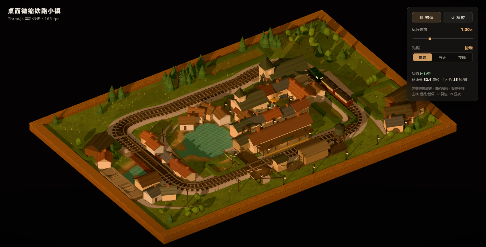

# 桌面微缩铁路小镇 · Miniature Railway Town

一个用 **Three.js** 搭建的桌面微缩沙盘：木质展示底座上放着一座围绕闭合铁路规划出来的模型小镇——车站、镇中心、教堂、磨坊、河与湖、跨河铁路桥、公路石拱桥、平交道口、田块、果园、路灯与电报杆，白天／夜晚／傍晚三套光照。

页面打开即可看到完整沙盘，列车默认运行。



---

## 快速开始

```bash
npm install     # 安装依赖（three + vite）
npm run dev     # 开发模式，默认 http://localhost:5467
npm run build   # 产物输出到 dist/
npm run preview # 预览构建产物，默认 http://localhost:5468
```

> 需要 Node.js ≥ 18（开发时使用 Node 24 验证）。无需后端、无需任何外部素材（所有贴图都是运行时用 Canvas 生成的）。

---

## 操作方式

| 操作 | 方式 |
| --- | --- |
| 旋转视角 | 鼠标左键拖拽 |
| 缩放 | 滚轮 / 触控板捏合 |
| 平移 | 鼠标右键拖拽 |
| 运行 / 暂停 | 右上角「暂停」按钮，或空格 |
| 调节速度 | 速度滑块 0.25× ~ 3.00× |
| 昼夜切换 | 右上角「傍晚 / 白天 / 夜晚」三段按钮，或 `N` |
| 复位 | 右上角「复位」按钮，或 `R` |

- **运行/暂停**：暂停时列车与「到站停留倒计时」会同时冻结。
- **到站停留**：每次机车抵达车站停车约 **2 秒**（不随速度倍率缩放）后自动继续，无需上下客动画。
- **复位**：恢复初始机位（方位角 −34°、仰角 35°、缩放 1.0）、列车位置、速度 1.00×、运行状态与默认「傍晚」光照。

---

## 沙盘构成

```
                 ▲ -Z（北）
   ┌──────────────────────────────────────────────┐
   │  北侧针叶林        闭合铁路（周长 82.4 单位）   │
   │  ╭──────────────────────────────╮            │
   │  │        湖  ↖ 河  ← 铁路桥      │  磨坊      │
西 │  │   河畔小屋    镇中心  教堂      │  石拱桥    │ 东
   │  │   ┌──── 集市广场 / 喷泉 ────┐   │  农田果园  │
   │  │   │  站前广场 → 车站站台 → 货场│   │           │
   │  ╰──────────────────────────────╯            │
   │        平交道口（道路穿轨）→ 东南农场           │
   └──────────────────────────────────────────────┘
                 ▼ +Z（南）
```

- **底座**：44 × 30 的木托盘，带厚度、围板与顶部压边线脚；程序生成木纹（顺纹 + 板缝 + 板间色差）。
- **闭合铁路**：圆角矩形中线（四个转角半径不同：西南 3.0 / 东南 3.6 / 东北 3.0 / 西北 2.6），由 CatmullRom 过控制点后按弧长等距重采样成 2600 个采样点，列车、钢轨、枕木、道砟全部由它派生，因此轨道严格闭合连续。
- **轨道构造**：梯形道砟 + 165 根实例化枕木 + 沿路径扫掠的工字钢轨截面（轨顶高光、轨腰暗色）。
- **跨河结构**：西侧直线段跨越河道处设**钢板梁桥**——石砌桥台 + 带上下翼缘与加劲肋的主梁 + 横梁斜撑 + 跨间人行道栏杆；另在环线外西侧另有一座**石拱公路桥**跨越同一河道。
- **水系**：河道自西侧入画，向东展开成湖，只与铁路相交一次（因此只需一座铁路桥）。地面是 214 × 146 的网格，按到水域轮廓的有符号距离下切出河床与岸坡，水面略微内缩以避免与岸坡 z-fighting。
- **小镇**：车站（站台 + 雨棚 + 站房 + 水鹤 + 长椅）、站前广场、集市广场（喷泉 + 市集摊位）、带钟楼的市政厅、带尖塔的教堂、镇中民居与临街商铺、滨湖货栈与木吊车、3 户河畔小屋、磨坊（带水轮）、谷仓 3 座、信号楼、水塔、工务小屋、煤台、货车板。
- **道路**：19 段带状路面（干道 / 巷 / 小径三级材质）把车站—广场—教堂—湖滨—河畔—平交道口—农场串联起来，路面两侧有深色路肩。
- **植被**：4 类实例化树木（松、阔叶、白杨、果树）共约 200 株，环线内沿湖与街巷、环线外沿边界与田块分布；另有 620 丛实例化草丛，主要集中在水岸附近。
- **沿线设施**：沿铁路外侧每 4.6 单位一根电报杆（双横担 + 绝缘子），平交道口有交叉板、信号灯与抬起的道口栏。

## 列车运动

- 编制为 **1 节蒸汽机车 + 2 节客车**，车长分别为 1.55 / 1.35 / 1.35（半长），钩距 0.36。
- 三节**各自**按弧长取样：`s_i = s_head - offset_i`，位置取自中线重采样点，朝向由「车体前后各 0.62 半长处的两点连线」求得 —— 因此过弯时每节车厢自然内移、朝向互不相同，而不是整列当刚体绕中心旋转。
- 车轮与连杆按 `s / r` 转动，连杆 crank 销相位与车轮一致。
- 到站判定用「本帧前进距离 ≥ 距站弧长」+ 布防标志（驶离 3 单位后才重新布防），避免停留结束后立刻重复触发。

## 光照

| 模式 | 太阳 | 半球光 | 环境光 | 特征 |
| --- | --- | --- | --- | --- |
| 傍晚（默认） | 暖橙 `#ffbe86`，强度 4.3，低角度斜射 | 暖色 1.0 | 0.40 | 长投影、窗户微微透亮 |
| 白天 | 中性偏暖 `#fff4e2`，强度 5.0，高角度 | 冷天光 1.45 | 0.50 | 材质色彩最易分辨 |
| 夜晚 | 月光 `#9db4de`，强度 0.85 | 夜蓝 0.62 | 0.26 | 车站/路灯发光、窗户全亮、4 盏暖色点光 |

三套参数之间用 1.1 秒平滑插值过渡（含背景穹顶渐变、雾色雾距、曝光）。窗户、客车窗玻璃、路灯玻璃、灯光锥与水面亮度都随模式联动。

## 性能

- 静态几何按材质族合并（`bake()` 烘焙顶点色），典型帧 **87 draw call / 约 17 万三角形**。
- 树木、草丛、枕木使用 `InstancedMesh` + 逐实例颜色。
- 定向光阴影 2048²，紧贴沙盘的正交视锥，`normalBias 0.035`。
- 像素比上限 2；`NeutralToneMapping` 色彩还原优于 ACES。

---

## 项目结构

```
railway-town/
├─ index.html            页面骨架 + 控制面板
├─ vite.config.js        端口 5467 / 5468（避免与本机其它服务冲突）
├─ src/
│  ├─ main.js            引导、等距正交相机、OrbitControls、HUD 接线、主循环
│  ├─ styles.css         控制面板与暗角样式
│  ├─ core/
│  │  ├─ config.js       底座 / 轨道 / 水系 / 站场尺寸与全部配色
│  │  ├─ rng.js          确定性随机（mulberry32），沙盘每次刷新完全一致
│  │  ├─ geo.js          几何工具：面片、叠瓦屋顶、沿折线带状体、截面扫掠、顶点色烘焙
│  │  └─ textures.js     Canvas 程序贴图：木纹、草地、碎石、卵石、瓦面、水面法线、垄沟
│  └─ world/
│     ├─ path.js         闭合中线 + 弧长采样（sample / nearest / frames）
│     ├─ layout.js       道路、田块、货场的规划数据（建筑与植被都避让它）
│     ├─ terrain.js      托盘底座、下切地面网格、水面、田块、草丛
│     ├─ track.js        道砟 / 枕木 / 钢轨 / 铁路桥 / 公路桥 / 平交道口
│     ├─ town.js         车站、市政厅、教堂、货棚、磨坊、谷仓、民居、码头、道路与广场
│     ├─ scatter.js      树木实例化、路灯、电报杆、沿线设施、围栏、小船
│     ├─ train.js        机车与客车建模、编组、独立弧长运动、到站停留
│     └─ lighting.js     三套光照预设、渐变天空穹顶、星空、插值过渡
```

## 原交付验证说明

交付者记录了 28 项自动化断言与帧率测试。本次归档不保留临时验收脚本和报告；该记录未由画廊逐项复验。

## 已知取舍

- 轨道是严格水平的平曲线，因此列车只有偏航、没有俯仰；跨河桥与路基同高。
- 地面是平面沙盘（不做地形起伏），河床/岸坡由网格下切得到。
- 夜空的星星几何保留在场景里，但当前相机俯角下背景只落在地平线以下，实际看不到，属于预留资源。
- 树木、草丛为低多边形实例化，刻意保留平面着色以贴合「手工模型」质感。


## 画廊收录（2026-09-26）

- 模型：Space-bunny Max；推理档位 Max，来自交付文件名；Space-bunny 厂商待确认。
- 来源：用户提供的 bunny-铁路小镇-max.zip。桌面归档：`miniature-railway-town/space-bunny-max/`。未提供独立的生成提示词记录，按所属桌面题目归档；不能确认原提示词逐字一致。
- 保留核心源码、必要配置和已有说明/展示资源；不收录原交付测试、缓存和重复锁文件。原说明中的测试结果属于交付者记录，不代表本次复验。
- 为 GitHub Pages 子路径设置 Vite `base: './'`，原作布局与交互保持交付状态。
- 仓库运行：`npm install`，`npm run build --workspace=gallery-miniature-railway-town-space-bunny-max`；桌面目录可独立 `npm install && npm run build`。
- 本次核验：构建、桌面与手机默认首屏、卡片模型包及一项关键交互；具体结果见 [收录记录](../../../docs/archive/2026-09-26-new-results.md)。未做全部交互或手机真机性能验证。

- 首屏目视记录：手机控制面板遮挡部分标题，沙盘主体可见。保留原作默认视角与布局。
