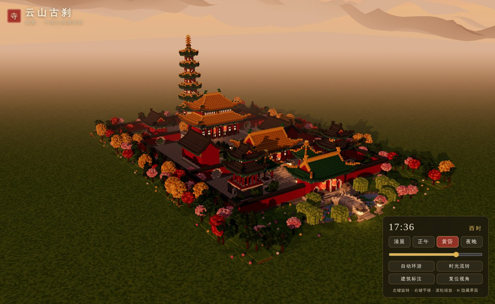
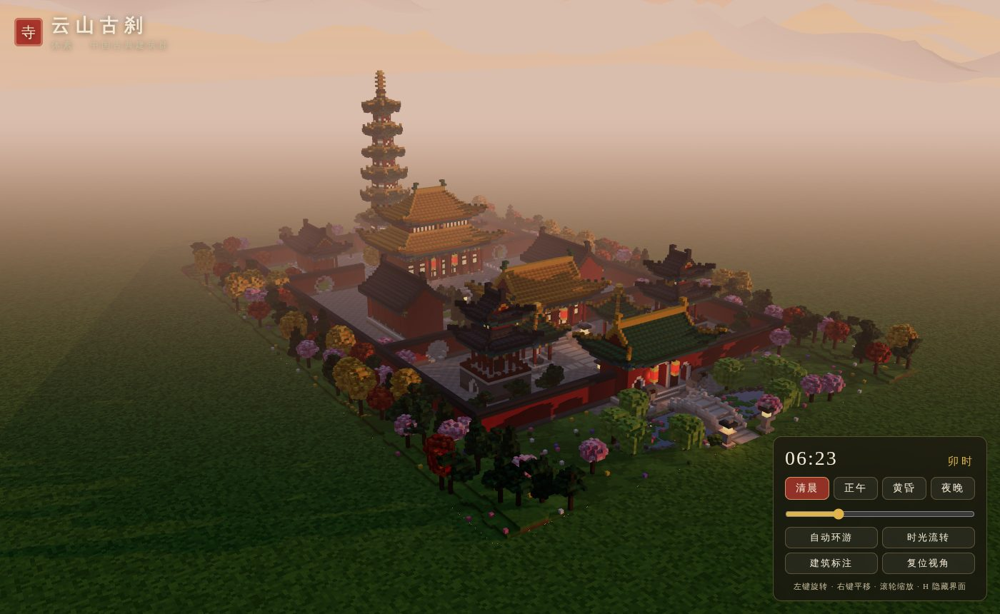
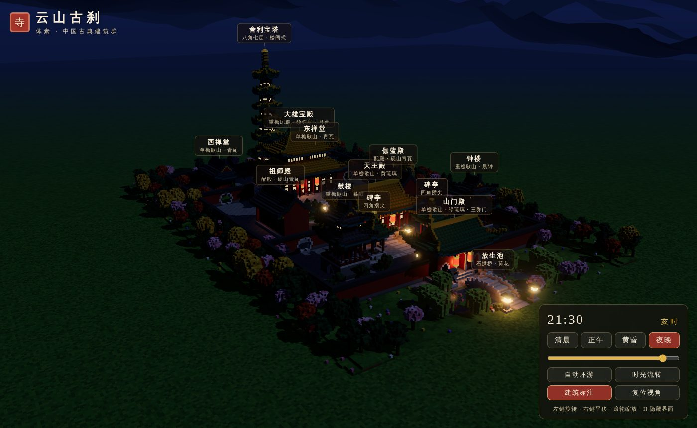
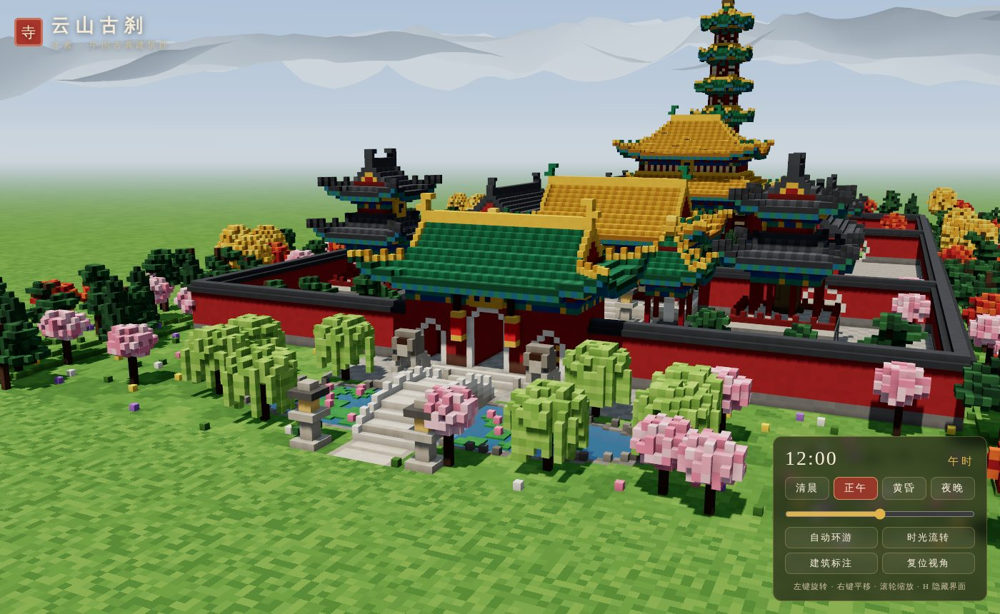
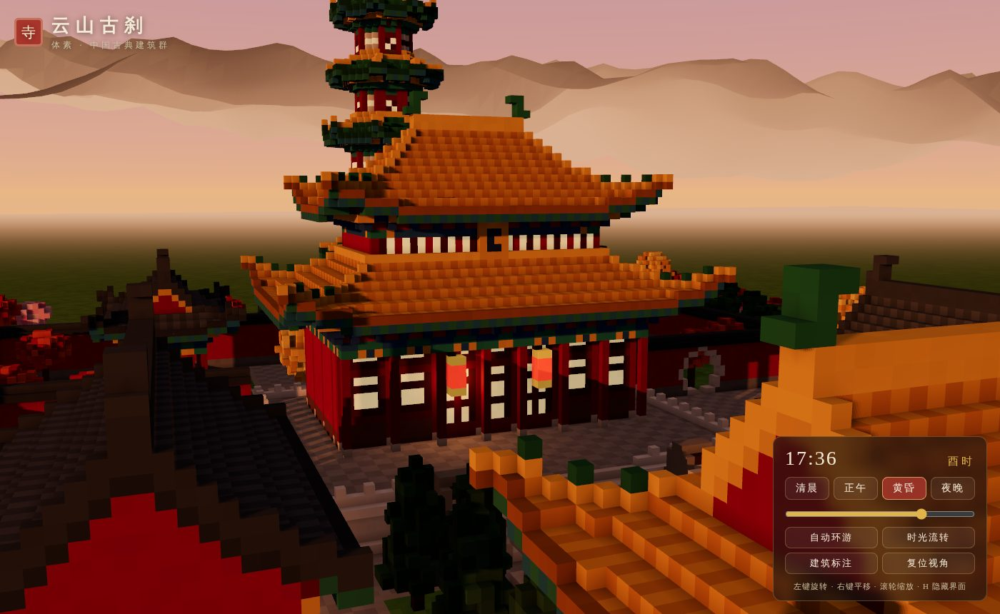

# 云山古刹 · 体素中国古典建筑群

用 **Three.js + Vite**（原生 JS，无后端）实现的 3D 体素（Voxel）风格中国古典寺院建筑群。页面打开即自动生成整座寺院并进入黄昏场景，镜头缓慢环游，无需任何操作即可看到全貌。

**在线访问：<https://wsnxxxs.github.io/Test_Chinese_architecture/results/opus-5.5-high/>**（GitHub Pages；仓库首页为各模型结果总览）



| 清晨薄雾 | 夜晚灯火（开启建筑标注） |
| --- | --- |
|  |  |
| **正午 · 山门、石狮、放生池与石拱桥** | **黄昏 · 大雄宝殿（重檐庑殿）近景** |
|  |  |

## 运行方式

需要 Node.js ≥ 18（已在 Node 22 上验证）。

```bash
npm install        # 安装依赖（three、vite）
npm run dev        # 开发模式，浏览器打开终端里显示的地址（默认 http://localhost:5173）
npm run build      # 生产构建，输出到 dist/
npm run preview    # 本地预览构建产物（默认 http://localhost:4173）
npm run check      # 可选：在 Node 中无浏览器生成体素世界，输出体素数/面数/对称性等统计
```

`dist/` 使用相对路径（`base: './'`），可直接部署到任意静态服务器子目录。

## 场景构成

整座寺院坐北朝南，**沿中轴线严格对称**：院内建筑占位的镜像一致率为 97.5%（`npm run check`），不一致的部分只来自随机分布的树木与花草。从南到北共五进空间，另有院外山水：

```
 北  ┌──────────── 后山松林（缓丘） ────────────┐
     │ 西禅堂        舍利宝塔（八角七层）        东禅堂 │  后院
     ├──── 月洞门 ──── 大雄宝殿（重檐庑殿） ──── 月洞门 ──┤
     │                  月台 · 御路踏跺 · 石狮            │
     │ 祖师殿   柏树   香炉 · 石灯   柏树   伽蓝殿 │  中院
     ├──── 月洞门 ──── 天王殿（单檐歇山） ──── 月洞门 ──┤
     │ 鼓楼   碑亭        御道        碑亭   钟楼 │  前院
     └────────────── 山门殿（三券门） ──────────────┘
 南            石狮 · 放生池 · 石拱桥 · 垂柳
```

| 建筑 | 数量 | 形制与细节 |
| --- | --- | --- |
| **大雄宝殿**（主殿） | 1 | 面阔七间，**重檐庑殿顶**黄琉璃，正脊鸱吻、垂脊走兽；汉白玉**须弥座**台基、宽阔**月台**、汉白玉栏杆，带**御路石**的踏跺；前廊、隔扇门窗、竖匾、廊下红灯笼 |
| **天王殿** | 1 | 面阔五间，**单檐歇山顶**黄琉璃，前后踏跺，带山花、横匾、灯笼 |
| **山门殿** | 1 | **单檐歇山顶**绿琉璃黄剪边，红墙三券门，中券洞开，侧券为带金门钉的朱门；前后挂灯笼 |
| **配殿**：伽蓝殿、祖师殿 | 2 | 东西相对，**硬山顶**青瓦，山墙与屋面齐平 |
| **后院禅堂**：东禅堂、西禅堂 | 2 | **歇山顶**青瓦 |
| **钟楼 / 鼓楼** | 2 | 砖砌城台（券洞穿行）+ **重檐歇山**敞楼，东楼悬钟、西楼置鼓（“晨钟暮鼓”） |
| **碑亭** | 2 | 四柱敞亭，**四角攒尖**绿琉璃 + 金宝顶，亭内龟趺石碑 |
| **舍利宝塔** | 1 | **八角七层楼阁式**，逐层收分，每层斗拱、翘角塔檐、门窗，**八角攒尖**顶 + 覆钵相轮宝珠塔刹 |

各建筑间留有庭院与道路。中轴御道从石拱桥一直通到宝塔，另有横向支路通往钟鼓楼、配殿和禅堂。院墙、隔墙上开**月洞门**。

### 古建细部（体素化实现）

- **屋顶**：统一采用高度场描述屋面，剖面为**举折曲线**，即檐口平缓、近脊陡峭。翼角处叠加**起翘**量，四角再挑出一个体素，形成**飞檐翘角**。已实现庑殿、歇山（含山花与博风金边）、硬山、四角攒尖、八角攒尖、重檐（下檐环形坡屋面 + 围脊）等形制。瓦面按筒瓦垄交替着色，檐口一圈为瓦当色，檐下为青绿彩绘椽子。
- **斗拱**：柱头以上逐层外挑，拱位（每 3 格一朵，转角必有）比补间多挑一跳，青绿相间、金色拱头。
- **梁枋彩画**：两层额枋，按距柱远近分出箍头（绿）、找头（金）、枋心（蓝），檐下天花为青绿棋盘格。
- **柱网与门窗**：红柱、石柱础；明间与次间为隔扇门（裙板 + 棂条分隔的窗纸格心），梢间为槛窗 + 槛墙；窗纸在夜晚透出暖光。
- **陈设**：石狮（成对，一侧踩绣球、一侧带幼狮）、鼎式香炉（炉内炭火发光）、石灯笼、红灯笼、匾额、石碑、钟、鼓。
- **环境**：方砖铺地、御道条石、树池草地、放生池（荷叶荷花、驳岸山石）、石拱桥、院外松柏、银杏、枫、樱、垂柳林带与花草，北侧缓丘，远处环形群山（北高南低，“背山面水”）。

## 光影与氛围

- 一盏**方向光**（太阳或月亮）投射 4096² 阴影。阴影相机每次按光线方向，把整个体素包围盒贴合到光空间里，精度稳定。**半球光**提供天空与地面的环境色。体素网格化时逐顶点烘焙**环境光遮蔽（AO）**，墙角、檐下、斗拱之间自然变暗，层次分明。
- **昼夜系统**：共 11 个关键帧，按线性色彩空间插值天空顶色、地平线色、主光色与强度、环境光、雾色、灯火强度和星空。太阳东升西落，正午偏南；夜晚切换为月光。
- **晨昏色调**：默认时刻为 **17:36（酉时）黄昏**，暖橙色低角度阳光拉出长阴影，灯笼与窗纸渐亮。**清晨**为粉橙色天光加薄雾。另提供**正午**、**夜晚**两种色调，拖动滑块可连续调整全天 24 小时。
- **灯火**：灯笼、窗纸、石灯、香炉炭火使用自定义的顶点自发光通道（在 `MeshStandardMaterial` 上扩展 `onBeforeCompile`），亮度随时间变化。另选 10 处分布最均匀的灯火放置实时点光源，配合 **Bloom 泛光**，夜景灯火通明。
- 渐变天穹（日盘/月盘、光晕）、星空、随时间变化的雾色；水面使用由天空实时生成的 PMREM 环境贴图做反射。

## 交互

| 操作 | 说明 |
| --- | --- |
| 左键拖动 / 右键拖动 / 滚轮 | 旋转 / 平移 / 缩放（手动操作后 6 秒恢复自动环游） |
| 清晨 · 正午 · 黄昏 · 夜晚 | 平滑过渡到对应时刻 |
| 时间滑块 | 0–24 时连续调节，显示十二时辰 |
| 自动环游 / 时光流转 / 建筑标注 / 复位视角 | 开关镜头环游、昼夜自动流转、建筑名称标注 |
| `H` | 隐藏 / 显示界面 |

URL 参数（便于截图或分享视角）：`?t=6.4`（时刻）、`rotate=0`（关闭环游）、`flow=1`、`labels=1`、`cam=x,y,z&look=x,y,z`（机位与目标点）。

## 技术实现与性能

```
index.html
src/
  main.js              渲染器、相机/控制、光照、阴影贴合、后期、UI、主循环
  config.js            体素世界尺寸（192×112×288）与中轴
  voxel/
    world.js           稠密体素网格（Uint8 调色板索引）+ 建筑局部坐标系 Frame（四向朝向、左右镜像对称）
    palette.js         调色板（颜色、亮度抖动、自发光强度）
    mesher.js          分块面剔除网格化 + 顶点 AO + 夜间自发光材质
  build/
    layout.js          总平面：地面铺装、道路、放生池、石桥、全部建筑、院墙、陈设、植物
    hall.js            通用殿堂生成器（台基/柱网/门窗/额枋/斗拱/重檐/屋顶/匾额/灯笼）、钟鼓楼、宝塔
    roofs.js           庑殿、歇山、硬山、攒尖、重檐下檐、八角塔檐的高度场屋面算法
    parts.js           台基、踏跺、栏杆、斗拱、券门、灯笼、石灯、石狮、香炉、钟、鼓、石碑
    nature.js          噪声、地形、各类树木、花草
  render/
    sky.js             渐变天穹 + 日月 + 星空
    timeOfDay.js       昼夜关键帧与日月方向
    landscape.js       远山、外围地面
check-world.mjs          Node 端自检脚本
```

性能相关设计：

1. **程序化生成**：不依赖任何模型或贴图资源，启动时约 0.1 秒生成全部体素（约 40 万个实体体素）。
2. **面剔除网格化**：只输出与空气相邻的面（22.6 万个可见面，约 45 万个三角形），相对“每个体素一个立方体”的做法减少一个数量级以上。按 48×48 分为 24 个区块，支持视锥剔除。顶点属性使用紧凑类型（法线 Int8、颜色 Uint16、自发光 Uint8）。
3. **阴影缓存**：场景静态，`shadowMap.autoUpdate = false`，只在光照方向变化时重绘阴影贴图。连续调时间时每 4 帧重绘一次。
4. 限制像素比（≤ 1.75），每帧绘制调用约 40 次（含后期处理）。

## 运行结果

以下为本作品原始实现时的运行记录；本仓库整理后会重新验证构建与检查脚本：

- `npm install`、`npm run build` 成功：输出 `dist/`，JS 约 87 kB，three.js 单独分块约 549 kB，gzip 后约 30 kB + 139 kB。
- `npm run dev` 与 `npm run preview` 都能正常提供页面。
- `npm run check` 输出：192×112×288 的世界、401,509 个实体体素、226,268 个可见面、24 个区块、13 个标注（含 12 座建筑及放生池）、26 处灯火、中轴镜像一致率 97.5%。
- 用 Playwright 驱动无头 Chromium 打开页面：场景自动加载，控制台无报错。时间预设、滑块、时光流转、环游、缩放和窗口缩放都已验证。上方截图即由此生成，1400×860 与 390×844（手机竖屏）两种尺寸的布局都正常。
- **帧率**：容器内没有 GPU，只能用 **SwiftShader（CPU 软件光栅化）** 渲染。在 1400×860 分辨率下开启 4× MSAA、阴影和泛光，稳定在约 **15–20 FPS**。实际 GPU 上的帧率在此环境中无法测量。任何一块独立显卡或较新的集成显卡都比 CPU 软件渲染快很多，因此在实际 GPU 上应能超过 30 FPS 的目标。实际帧率会显示在页面左下角。
