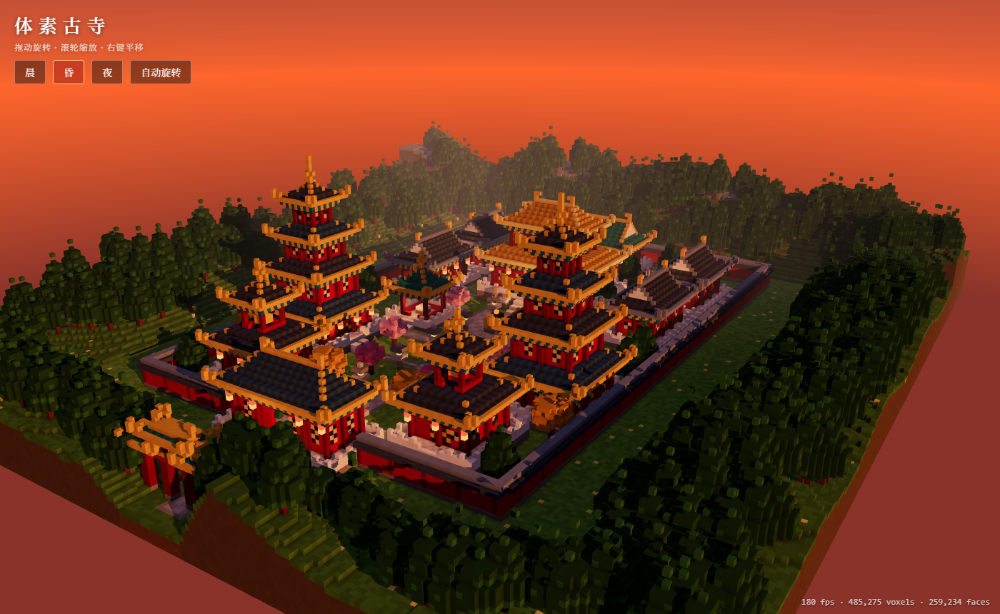

# 体素古寺 — Voxel Chinese Temple (Three.js + Vite)



```bash
npm install
npm run dev      # http://localhost:5173
npm run build    # production build in dist/
npm run preview
```

- `src/voxel.js` – voxel grid → single face-culled, vertex-AO mesh (2 draw calls)
- `src/buildings.js` – parametric hall / gate / pagoda / tower / pavilion / paifang, roofs, lions, trees
- `src/world.js` – terrain, paving, compound layout (central axis, mirrored)
- `src/main.js` – renderer, sun shadows, dawn/dusk/night presets, UI
