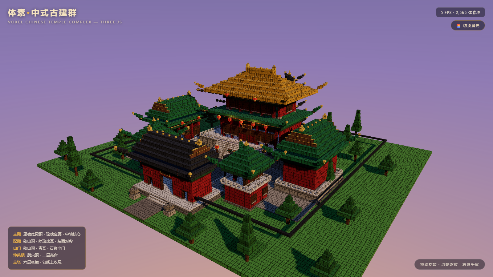

# 体素 · 中式古典建筑群 (Voxel Chinese Temple Complex)

此项目由用户作为 Step 5 Preview 的结果提供。压缩包未附单独的提示词文本，因此未记录与仓库题目提示词的差异。

基于 **Three.js + Vite** 的纯前端 3D 场景：以 Minecraft 式体素块拼接出一座中轴对称的中国古典建筑群。
打开页面即自动入场（镜头俯冲推进），随后缓慢环绕展示，无需任何操作即可看到全貌。



## 运行方式

```bash
# 安装依赖（Node 18+）
npm install

# 开发模式（默认 http://localhost:5173）
npm run dev

# 生产构建
npm run build

# 本地预览构建产物（默认 http://localhost:4173）
npm run preview
```

无后端、无外部资源请求，构建产物为纯静态文件，可直接部署到任意静态托管。

## 场景内容

### 建筑群（中轴对称院落，共 7 座单体建筑）

| 建筑 | 位置 | 形制 | 说明 |
| --- | --- | --- | --- |
| **主殿** | 中轴核心（场地最北） | 重檐庑殿顶 | 体量最大：双层屋檐、琉璃金瓦、七开间、斗拱额枋、匾额、隔扇门、6 盏宫灯，汉白玉台基 + 栏杆 + 三出踏步 |
| **配殿 ×2** | 主殿前东西两侧 | 单檐歇山顶 | 严格对称：绿琉璃瓦、木色山花 + 博风金边、五开间、朝向中轴 |
| **山门** | 场地前端入口 | 歇山顶 · 青瓦 | 三门洞、匾额、石狮一对守门，宫墙在左右收头 |
| **钟楼 / 鼓楼** | 庭院前部左右 | 二层攒尖顶 | 高台砖基 + 券门、白色平座栏杆、内悬铜钟 / 红鼓 |
| **宝塔** | 主殿之后、轴线收尾 | 六层密檐 | 逐层收分、灰瓦密檐 + 金色翘角与塔刹，与主殿形成高低呼应 |

### 空间与动线

- 明确的中轴线：**山门 → 前广场/神道 → 庭院 → 御路 → 主殿踏步**，另有东西甬路连接两配殿、塔前甬路。
- 建筑间距按体素比例留足道路与庭院，红墙围合整座院落，墙内外植松柏。
- 庭院铺装区分等级：御路/甬路用深色石，庭院用浅色石，路缘石压边；其余为草地（带斑块变化）。

### 中式细节

- **屋顶**：飞檐翘角（四角逐块向外上挑 + 金色角铃）、庑殿/歇山/攒尖/密檐四种形制、正脊吻兽与脊饰、山花博风。
- **结构**：立柱（带柱础）、额枋、斗拱（斗 + 拱交替、金绿相间）、台基、栏杆、垂带石台阶。
- **色彩**：红墙、朱砂柱、金/绿琉璃瓦、青瓦、汉白玉台基、木色山花、金饰边。
- **小陈设**：匾额、门钉、棂条格心窗、宫灯（含真实点光源辉光）、石狮、青铜香炉、灯柱、花坛、松柏。

### 环境与光影

- 黄昏（默认）/ 晨光双预设，右上角一键切换：太阳角度/色温、天穹渐变、雾色、灯笼点光强度随之变化。
- 方向光阴影（PCFSoft 2048²）+ 半球环境光 + 冷色补光，建筑投影落在庭院与道路上，层次分明。
- 渐变天穹 + 太阳光晕 sprite，远处雾效衔接地平线。

## 技术实现

- **体素构建器**（`src/voxel.js`）：所有构件以 box 为单位累加，每面按真实尺寸生成 UV，使任意大小的体块都呈现 1×1 的方块网格（程序化噪点贴图 + 深色接缝 + 最近邻过滤）。
- **单 draw call**：全部 2,565 个体块（约 3.1 万三角形）的面合并为一个 `BufferGeometry`，顶点色承担调色板与随机色偏，一次绘制完成整个世界，旋转视角无批次压力。
- **参数化建筑库**（`src/buildings.js`）：`hipRoof / xieshanRoof / pyramidRoof` 三种屋顶生成器（分层收分 + 翘角 + 脊饰）、`eaveStructure` 斗拱环带、`platform / railing / steps2 / column / wallPanel / doorPanel / latticeWindow` 等通用构件，建筑由此拼装而非手摆。
- **可复现随机**：mulberry32 种子随机，草地斑块、树形每次构建一致。
- 入场镜头用 easeInOutCubic 从高空俯冲至全景机位，之后交给 OrbitControls 自动环绕（可拖拽/滚轮/右键平移交互）。

## 项目结构

```
voxel-chinese-temple/
├── index.html            # 页面 + HUD（标题/图例/统计/晨昏切换）
├── package.json
├── preview.png           # 场景预览图
├── scripts/
│   └── shot.mjs          # 无头浏览器截图脚本（可选，用于视觉验证）
└── src/
    ├── main.js           # 渲染器、相机、光照、天空、晨昏预设、主循环
    ├── scene.js          # 场景装配：地面/道路/宫墙/建筑/陈设/植被
    ├── buildings.js      # 建筑构件库与 5 类建筑单体
    ├── voxel.js          # 体素构建器（合并几何 + 体素贴图）
    └── palette.js        # 中式古建调色板
```

## 已验证的运行结果

- `npm install` / `npm run build` / `npm run preview` / `npm run dev` 均正常（Vite 5.4 + Three 0.169，构建无错误无警告）。
- 已用无头 Edge（SwiftShader 软件渲染）实际渲染并截图核对：全景、主殿正面、山门、钟鼓楼、宝塔、院落后侧等多视角均正确，晨/昏两种预设均正常切换。
- 截图环境中帧率为 2–5 FPS，这是纯 CPU 软件光栅化 1600×900 的结果；场景几何预算很低（约 3.1 万三角形、单 draw call、单张 2048² 阴影贴图），在任何独立/集成 GPU 上都可轻松达到 60 FPS（页面右上角实时显示帧率与体素数）。
- 可选验证脚本：`node scripts/shot.mjs out.png <相机x,y,z> <目标x,y,z> [等待ms]`（需先启动 preview 服务，并安装 `puppeteer-core`）。
